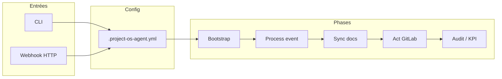

# Documentation projet — Project OS Agent

Documentation technique et fonctionnelle complète du projet **Project OS Agent** : agent IA de gouvernance de projet GitLab (CLI Python + serveur webhook).

---

## 1. Vue d’ensemble

### 1.1 Qu’est-ce que Project OS Agent ?

Project OS Agent est un **outil CLI Python** et un **serveur webhook HTTP** qui :

- **Pilote la gouvernance** d’un dépôt GitLab via des événements (MR, issues, pipelines).
- **Maintient automatiquement** les fichiers Markdown de référence (specs, statut, décisions, sécurité, etc.).
- **Détecte les écarts** entre vision produit, code, CI et documentation.
- **Propose des actions** concrètes (MR, issues, commentaires) avec justification.

Il n’y a **pas d’interface graphique** : toute interaction se fait par **ligne de commande** ou **endpoints HTTP** (webhook).

### 1.2 Objectifs

- Réduire la dérive entre spécifications et implémentation.
- Automatiser le pilotage du projet (next steps, cohérence des docs).
- Rendre le dépôt exploitable par les humains **et** par d’autres agents IA.
- Améliorer l’onboarding, la gouvernance et la traçabilité des décisions.

### 1.3 Périmètre fonctionnel

**In scope :**

- Gestion des fichiers `.md` de pilotage (création depuis templates, mise à jour ciblée).
- Traitement d’événements GitLab (MR, issue, pipeline).
- Génération de « next steps » standardisées.
- Ouverture / mise à jour de MR et issues (via API GitLab, si activée).

**Out of scope :**

- Écriture autonome de features produit complexes.
- Déploiement en production sans validation humaine.
- Décisions produit irréversibles sans validation.
- Modifications silencieuses sans trace Git (tout passe par MR/branche).

### 1.4 Références

- **AGENT_GLOBAL_SPEC.md** : spécification globale de l’agent (mission, règles, KPIs, backlog).
- **project.md** (ou PRODUCT_SPEC) : vision produit, user stories, triggers.
- **AGENTS.md** : instructions Cursor / agents (commandes, tests, gotchas).

---

## 2. Architecture technique

### 2.1 Structure du dépôt

```
git-project-manager/
├── .project-os-agent.yml      # Configuration principale
├── tools/
│   ├── project_os_agent.py    # Point d’entrée CLI (parse_args + dispatch)
│   ├── project_os_bootstrap.py
│   ├── project_os_process_event.py
│   ├── project_os_sync_docs.py
│   ├── project_os_act.py
│   ├── project_os_serve_webhook.py
│   ├── project_os_report_kpis.py
│   └── project_os_agent_lib/  # Bibliothèque partagée
│       ├── __init__.py
│       ├── config.py          # Schéma config, load_config, ManagedFile, etc.
│       ├── audit.py           # Journal d’audit (log, read)
│       ├── guardrails.py      # Sécurité, rate limit, taille payload
│       ├── pipeline.py       # Bootstrap, process-event, sync-docs, webhook
│       ├── actor.py          # Phase 4 : opérations GitLab (MR, issues, commentaires)
│       ├── kpi.py            # Calcul KPIs, rapport hebdo
│       ├── diagnose.py       # Diagnostic config / dépôt / audit / GitLab
│       ├── workflows.py      # dry-run-global (bootstrap + event + KPIs)
│       └── cli_validation.py # Validation CLI (since_days, webhook host/port/path)
├── templates/                 # Fichiers .md sources pour bootstrap
│   ├── AGENTS.md
│   ├── API_SPEC.md
│   ├── ARCHITECTURE.md
│   ├── CLAUDE.md
│   ├── DECISIONS.md
│   ├── DOCUMENTATION.md
│   ├── PRODUCT_SPEC.md
│   ├── PROJECT_STATUS.md
│   ├── README.md
│   ├── ROADMAP.md
│   └── SECURITY.md
├── tests/
│   ├── test_template_regression.py  # Non-régression templates
│   ├── test_pipeline.py
│   ├── test_kpi.py
│   ├── test_guardrails.py
│   ├── test_cli.py
│   ├── test_diagnose.py
│   ├── test_workflows.py
│   └── template_snapshots.json      # Hashes des templates pour régression
└── requirements.txt           # PyYAML
```

### 2.2 Flux de données (simplifié)



- **Bootstrap (Phase 1)** : crée les fichiers manquants depuis `templates/`.
- **Process-event (Phase 2)** : normalise un payload GitLab, détecte les écarts, produit un plan d’actions.
- **Sync-docs (Phase 3)** : applique les mises à jour Markdown (PROJECT_STATUS, DECISIONS, etc.) de façon idempotente.
- **Act (Phase 4)** : exécute les opérations GitLab (branches, MR, issues, commentaires) si `gitlab.enabled` et token.
- **Phase 5** : audit (fichier JSONL), guardrails, rate limit, KPIs et rapports.

### 2.3 Dépendances

- **Python 3.10+**
- **PyYAML** (seule dépendance pip ; `pip install -r requirements.txt` ou `pip install pyyaml`).

---

## 3. Configuration (`.project-os-agent.yml`)

Fichier à la racine du dépôt. Résumé des sections principales :

| Section | Rôle |
|--------|------|
| `version` | Version du schéma (ex. 1). |
| `templates_dir` | Répertoire des templates (ex. `templates`). |
| `dry_run` | Si `true`, pas d’écriture par défaut ; `--apply` pour écrire. |
| `webhook` | `enabled`, `host`, `port`, `path`, `secret_env` pour le serveur webhook. |
| `policy` | `allowed_actions` / `forbidden_actions` (ex. open_merge_request, write_adr, …). |
| `phase3` | `stale_days`, `next_steps_default_owner`, `llm`, `mcp`. |
| `phase4` | `enabled`, `auto_sync_docs`, préfixes MR/issue, `comment_on_source_event`. |
| `phase5` | `audit` (log_file, redact_keys, max_entry_chars), `guardrails`, `rate_limit`, `kpi`. |
| `gitlab` | `enabled`, `api_url`, `project_id`, `token_env`, `target_branch`, `branch_prefix`, `labels`. |
| `managed_files` | Liste `template` → `target` (fichiers créés/mis à jour par l’agent). |
| `placeholders` | Substitutions appliquées aux templates (ex. `<SaaS Product Name>` → « Project OS Agent »). |

**Variables d’environnement typiques :**

- `GITLAB_TOKEN` : token API GitLab (si `gitlab.enabled: true`).
- `GITLAB_WEBHOOK_SECRET` : secret pour valider les requêtes webhook.
- `GEMINI_API_KEY` : optionnel, si phase3 LLM activée.

---

## 4. Commandes CLI

Point d’entrée unique : `python tools/project_os_agent.py <command> [options]`.

Si aucun argument n’est fourni, la commande par défaut est `bootstrap`.

### 4.1 Tableau des commandes

| Commande | Rôle |
|----------|------|
| `bootstrap` | Phase 1 : créer les fichiers de gouvernance manquants depuis les templates. |
| `process-event` | Phase 2 : normaliser un événement GitLab et produire un plan d’actions (JSON). |
| `sync-docs` | Phase 3 : appliquer les mises à jour Markdown (event-driven). |
| `act` | Phase 4 : exécuter les opérations GitLab (MR, issues, commentaires). |
| `serve-webhook` | Démarrer le serveur HTTP qui reçoit les webhooks GitLab. |
| `report-kpis` | Phase 5 : calculer les KPIs et produire un rapport Markdown hebdo. |
| `diagnose` | Générer un rapport de diagnostic (config, docs gérés, audit, GitLab). |
| `dry-run-global` | Enchaînement « bootstrap + process-event + rapport KPI » en mode dry-run (aucune écriture GitLab). |

### 4.2 Options communes

- `--config` : chemin vers le fichier YAML (défaut : `.project-os-agent.yml`).
- Pour les commandes événement : `--payload-json '...'` ou `--payload-file <path>` (ou stdin).
- `--event-name` : nom d’événement GitLab (ex. `Merge Request Hook`, `Issue Hook`).
- `--dry-run` / `--apply` : prévisualisation vs écriture réelle (bootstrap, sync-docs, act).
- `--no-diff` : masquer les diffs unifiés dans la sortie.
- `report-kpis` : `--since-days`, `--output`, `--stdout-only`.
- `diagnose` : `--output`, `--stdout-only`.
- `dry-run-global` : `--since-days`, `--no-kpi-markdown`.
- `serve-webhook` : `--host`, `--port`, `--path`, `--once` (une requête puis arrêt).

### 4.3 Contraintes documentées

- `report-kpis --since-days <n>` : `n >= 1`.
- `dry-run-global` : payload fourni par `--payload-json`, `--payload-file`, ou **stdin** si omis.
- Par défaut `dry_run: true` dans la config : il faut `--apply` pour écrire.

---

## 5. Workflows détaillés

### 5.1 Bootstrap

1. Chargement de la config et résolution du répertoire racine.
2. Pour chaque entrée de `managed_files` : si le fichier cible n’existe pas, il est créé depuis le template avec remplacement des `placeholders`.
3. Guardrails : chemins autorisés, pas de secrets dans le contenu, pas d’écriture sous `blocked_path_prefixes`.
4. En `--dry-run` : affichage des diffs sans écriture.

### 5.2 Process-event

1. Lecture du payload (JSON).
2. Normalisation (type d’événement, référence MR/issue/pipeline, etc.).
3. Détection des écarts (gaps) et génération d’actions proposées.
4. Filtrage par `policy` (allowed / forbidden).
5. Sortie : JSON avec `normalized_event`, `gaps`, `proposed_actions`, etc.

### 5.3 Sync-docs

1. À partir du même type de payload que process-event, mise à jour ciblée de PROJECT_STATUS.md, DECISIONS.md, etc.
2. Modifications minimales et idempotentes ; guardrails appliqués.

### 5.4 Act

1. Optionnellement exécution de sync-docs (sauf si `--skip-sync-docs`).
2. Appels API GitLab (création de branche, ouverture MR, création/mise à jour d’issues, commentaires) selon le plan d’actions autorisé.
3. Audit de chaque opération.

### 5.5 Serve-webhook

1. Serveur HTTP (ThreadingHTTPServer) sur `host:port`, chemin `path` (ex. `/webhooks/gitlab`).
2. Validation du secret (header ou body) si `secret_env` est défini.
3. Pour chaque requête POST reçue : appel du pipeline (process-event puis sync-docs / act selon config).
4. `--once` : traite une requête puis quitte (utile pour les tests).

### 5.6 Report-kpis

1. Lecture du journal d’audit sur la fenêtre `--since-days` (ou `phase5.kpi.rolling_days`).
2. Calcul des indicateurs (docs freshness, pipeline green streak, MR ouvertes, temps de réponse moyen, etc.).
3. Génération d’un rapport Markdown et écriture dans `phase5.kpi.report_dir` ou sortie stdout.

### 5.7 Diagnose

1. Vérification de la config, présence des templates, état des fichiers gérés, audit (fichier présent, nombre d’événements), GitLab (enabled, token présent).
2. Production d’un rapport Markdown (et optionnellement JSON) en stdout ou dans un fichier.

### 5.8 Dry-run-global

1. Validation du payload (taille, rate limit).
2. Bootstrap en dry-run (fichiers qui seraient créés).
3. Process-event sur le payload.
4. Génération du rapport KPI (sans écriture GitLab).
5. Sortie : JSON résumé + optionnellement le bloc Markdown KPI (`--no-kpi-markdown` pour n’avoir que le JSON).

---

## 6. Modules de la bibliothèque (`project_os_agent_lib`)

| Module | Responsabilité |
|--------|----------------|
| **config** | Chargement YAML, dataclasses (AgentConfig, ManagedFile, WebhookConfig, Phase3/4/5, GitLab, etc.), `load_config`, `_is_within`, `safe_text`, `ActionResult`. |
| **audit** | `log_audit_event`, `read_audit_events` (fichier JSONL, fenêtre temporelle). |
| **guardrails** | `assert_content_is_safe`, `assert_write_targets_allowed`, `validate_payload_size`, `enforce_rate_limit`, `GuardrailViolation`. |
| **pipeline** | `create_missing_files`, `process_event_pipeline`, `run_bootstrap`, `run_process_event`, `run_sync_docs`, `run_serve_webhook`, `_read_payload`, `_infer_event_name_from_payload`. |
| **actor** | Exécution des opérations GitLab (branches, MR, issues, commentaires) ; `run_act`. |
| **kpi** | `_compute_docs_freshness`, `_compute_pipeline_green_streak`, `_compute_kpis`, `generate_kpi_report`, `run_report_kpis`. |
| **diagnose** | `_build_diagnostic_metrics`, `_build_diagnostic_markdown`, `_resolve_output_path`, `run_diagnose`. |
| **workflows** | `run_dry_run_global` (orchestration bootstrap + event + KPI). |
| **cli_validation** | `resolve_config_path`, `resolve_since_days`, `resolve_webhook_settings` (host, port, path avec normalisation). |

---

## 7. Fichiers gérés et templates

Les fichiers listés dans `managed_files` sont soit créés au bootstrap (s’ils n’existent pas), soit mis à jour par sync-docs / act selon les événements.

Fichiers typiques : `AGENTS.md`, `API_SPEC.md`, `ARCHITECTURE.md`, `CLAUDE.md`, `DECISIONS.md`, `DOCUMENTATION.md`, `PRODUCT_SPEC.md`, `PROJECT_STATUS.md`, `README.md`, `ROADMAP.md`, `SECURITY.md`.

Les templates dans `templates/` contiennent des placeholders (ex. `<SaaS Product Name>`) remplacés par les valeurs de `placeholders` dans la config.

---

## 8. Triggers GitLab et comportements

- **Merge Request merged** : mise à jour PROJECT_STATUS, vérification PRODUCT_SPEC / ROADMAP, mise à jour ARCHITECTURE / API_SPEC si besoin, DECISIONS si décision implicite.
- **Issue created/updated** : validation qualité de l’issue, template de normalisation, enrichissement PROJECT_STATUS, proposition de next step en commentaire.
- **Pipeline failed** : classification de l’échec, marquage risque dans PROJECT_STATUS, ouverture d’issue de remédiation si récurrent.
- **Schedule (optionnel)** : cohérence globale des docs, consolidation KPIs, priorisation 24–72 h.

---

## 9. Sécurité et garde-fous

- Aucune modification directe sur `main` ; tout passe par branche + MR.
- **Guardrails** : chemins d’écriture autorisés/bloqués, détection de secrets dans le contenu, taille max du payload.
- **Rate limiting** : fenêtre temporelle et nombre max d’événements (config `phase5.rate_limit`).
- **Audit** : toutes les actions et commandes sont journalisées (JSONL) avec clés sensibles masquées.
- Permissions GitLab minimales ; pas de manipulation de secrets/PII dans les diffs.

---

## 10. KPIs et rapports

Indicateurs calculés (voir `kpi.py` et rapport hebdo) :

- Taux de docs à jour (`docs_freshness_ratio`).
- Temps moyen de réponse (issue/event → action).
- Nombre d’actions bloquées, MR ouvertes, succès MR.
- Série de pipelines verts (`pipeline_green_streak`).
- Autres métriques agrégées depuis l’audit (commandes, opérations, etc.).

---

## 11. Tests

- **Lancer tous les tests** : `python -m unittest discover -s tests -v`
- **Suites ciblées** : `python -m unittest tests.test_template_regression tests.test_pipeline tests.test_kpi tests.test_guardrails tests.test_cli tests.test_diagnose tests.test_workflows -v`

Les tests couvrent : non-régression des templates (snapshots), pipeline (process-event, bootstrap), KPI (helpers, rapport fichier), guardrails (taille payload, rate limit), CLI, diagnose, workflows (dry-run-global, rejet payload trop gros, rate limit).

---

## 12. Synthèse

Project OS Agent fournit :

1. **Bootstrap** des fichiers de gouvernance depuis des templates.
2. **Traitement d’événements** GitLab (MR, issue, pipeline) avec normalisation et plan d’actions.
3. **Sync documentaire** ciblée et idempotente.
4. **Actions GitLab** (MR, issues, commentaires) si l’intégration est activée.
5. **Audit, guardrails et rate limiting** pour la traçabilité et la sécurité.
6. **KPIs et rapports** (Markdown + diagnostic) pour le pilotage.
7. **Mode dry-run global** pour valider un scénario complet sans écriture GitLab.

Toute modification des fichiers du dépôt est conçue pour être tracée, réversible (via MR) et explicable (contexte, preuves, next steps).
